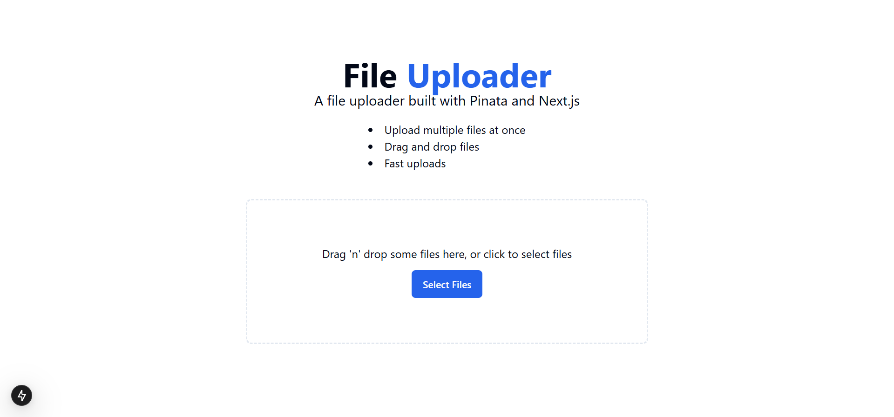

<div align="center">
<br/>

<br/>
  <div>
    
    
    
    
    

  </div>

<h3 align="center">File Uploads with Pinata</h3>

<div align="center">
  <a href="">🌐View live demo🌐</a>
</div>
  
</div>

## 📋 <a name="table">Table of Contents</a>

1. 🤖 [Introduction](#introduction)
2. ⚙️ [Tech Stack](#tech-stack)
3. 🔋 [Features](#features)
4. 🤸 [Quick Start](#quick-start)


## <a name="introduction">🤖 Introduction</a>

A complete file upload solution using Pinata's API, including both server-side and client-side uploads. Built a custom drag-and-drop interface, handling file deletions, and optimizing images with ease.

## <a name="tech-stack">⚙️ Tech Stack</a>

- React
- Next.js
- Pinata
- TailwindCSS
- TypeScript

## <a name="features">🔋 Features</a>

👉 **Custom Dropzone with Drag n Drop**: An interactive, user-friendly dropzone for smooth file uploads.

👉 **File Uploads (Server and Client-side)**: Handles both server-side and client-side uploads with `@pinatacloud`.

👉 **Temporary API Key (Presigned URLs)**: Secure uploads with temporary access using presigned URLs.

👉 **File Deletion**: Easily delete uploaded files when no longer needed.

👉 **Signed URLs**: Use signed URLs for secure file access.

👉 **Image Optimization**: Optimized images for faster loading and improved performance.

👉 **Minimalistic Design**: Fresh and simple UI with only the essentials for ease of use and a clean aesthetic.

## <a name="quick-start">🤸 Quick Start</a>

Follow these steps to set up the project locally on your machine.

**Prerequisites**

Make sure you have the following installed on your machine:

- [Git](https://git-scm.com/)
- [Node.js](https://nodejs.org/en)
- [npm](https://www.npmjs.com/) (Node Package Manager)

**Cloning the Repository**

```bash
git clone https://github.com/0ddFl3xx/file-uploader.git
cd file-uploader
```

**Installation**

Install the project dependencies using npm:

```bash
npm i
```

Currently, React 19 is still using a Release Candidate version. The above command may result in errors, so you might need to `--force` install the peer dependencies. In that case, you can use the following command:

```bash
npm i --force
```

**Set Up Environment Variables**
Go to the file named `.env` in the root of your project, rename it to `.env.local` and add:

```env
PINATA_JWT=
NEXT_PUBLIC_GATEWAY_URL=
```
Populate the values with your actual Pinata credentials. You can obtain these credentials by signing up & creating a new project on the [Pinata website](https://pinata.cloud/), the JWT token can be found in the **API Keys** section and the Gateway URL can be found in the **Gateways** section.

**NOTE:** Avoid committing your `.env.local` file to the repository.

Go to your `.gitignore` file and add the following line:

```env
# env files (can opt-in for commiting if needed)
.env*
```

**Running the Project**

```bash
npm run dev
```

Open [http://localhost:3000](http://localhost:3000) in your browser to view the project.